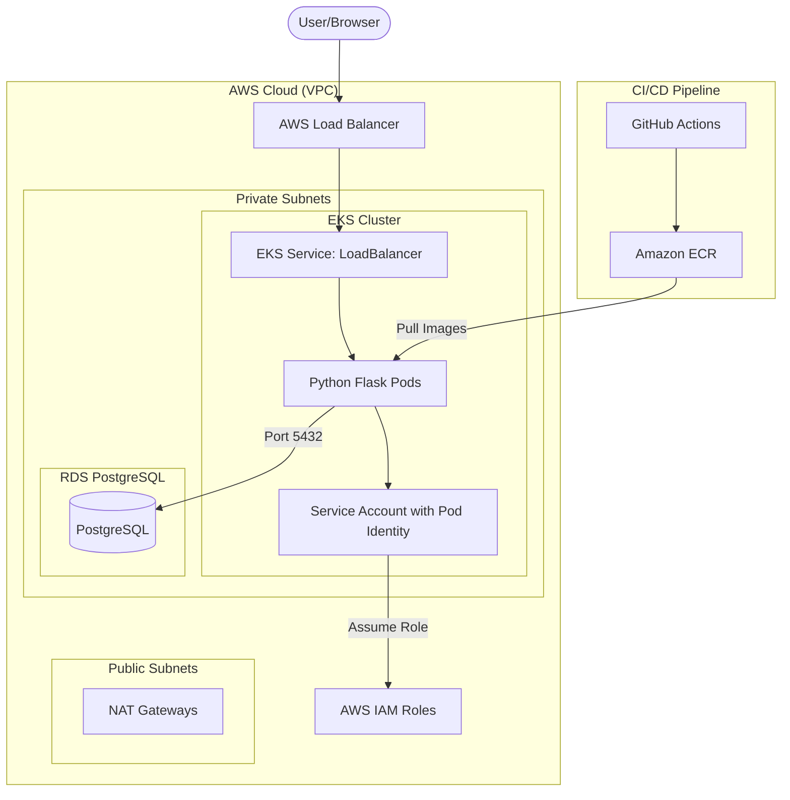

# Octa Byte AI - DevOps Assignment

This repository contains the infrastructure and deployment automation code for the Octa Byte AI interview assignment.

## Architecture

The infrastructure is provisioned on AWS using Terraform and consists of the following components:
- **VPC**: A Virtual Private Cloud with both public and private subnets.
- **EKS Cluster**: An Amazon Elastic Kubernetes Service cluster for application hosting.
- **RDS PostgreSQL**: A managed PostgreSQL database securely deployed in private subnets.
- **ECR**: Amazon Elastic Container Registry for storing Docker images.
- **Load Balancer**: Automatically provisioned by Kubernetes `LoadBalancer` Service to route external traffic to the frontend.

### Architecture Diagram



## Infrastructure Setup

1. **Prerequisites**:
   - AWS CLI installed and configured.
   - Terraform `~> 1.5.0` installed.
   - `kubectl` and `aws-iam-authenticator`.

2. **Deploying Infrastructure**:
   ```bash
   cd terraform
   terraform init
   terraform plan
   terraform apply -auto-approve
   ```

3. **Deploying the Application**:
   Once EKS is up, apply the Kubernetes manifests:
   ```bash
   aws eks update-kubeconfig --region us-east-1 --name 8byte-app-dev
   kubectl apply -f k8s/deployment.yaml
   kubectl apply -f k8s/service.yaml
   ```

## Security Considerations
- **Private Subnets**: EKS Nodes and RDS instances are isolated in private subnets with no direct internet access.
- **Security Groups**: Tight security groups limit RDS access to only the EKS nodes on port 5432.
- **Pod Identity**: EKS Pod Identity is used instead of static IAM credentials, granting the pods access only to the necessary AWS APIs.

## Cost Optimization Measures
- **Instance Types**: RDS is deployed on `db.t4g.micro` (Graviton2) which provides better price/performance.
- **Spot Instances (Optional)**: EKS Node groups can be configured to use spot instances for non-critical workloads to save costs.

## Challenges Faced & Resolutions

1. **Terraform Scoping for Module Dependencies**: 
   - *Challenge*: The EKS module initially referenced resources (`aws_vpc.main.id` and `aws_security_group.rds.id`) that were defined in other modules or root, causing scoping errors.
   - *Resolution*: Updated the EKS module variables to explicitly accept `vpc_id` and `rds_security_group_id` as inputs from the root `main.tf` outputs, enforcing a clean decoupled architecture.

2. **Pod Identity Agent Integration**:
   - *Challenge*: Properly securing the application pods using IAM roles without managing credentials manually.
   - *Resolution*: Leveraged the new EKS Pod Identity agent (via Terraform `aws_eks_addon` and `aws_eks_pod_identity_association`). This allowed the Python application to seamlessly assume an IAM role through its associated Kubernetes Service Account.
