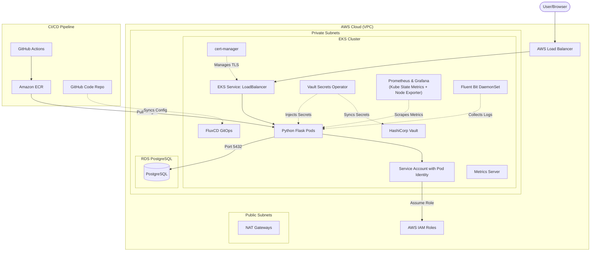

# Octa Byte AI - DevOps Assignment

This repository contains the infrastructure and deployment automation code for the Octa Byte AI interview assignment.

## Architecture

The infrastructure is provisioned on AWS using Terraform and consists of the following components:
- **VPC**: A Virtual Private Cloud with both public and private subnets.
- **EKS Cluster**: An Amazon Elastic Kubernetes Service cluster for application hosting, with managed add-ons: `vpc-cni`, `kube-proxy`, `coredns`, and `eks-pod-identity-agent`.
- **RDS PostgreSQL**: A managed PostgreSQL database securely deployed in private subnets.
- **ECR**: Amazon Elastic Container Registry for storing Docker images.
- **Load Balancer**: Automatically provisioned by Kubernetes `LoadBalancer` Service to route external traffic to the frontend.
- **HashiCorp Vault**: A centralized system for securely storing and managing secrets (like passwords and API keys).
- **Vault Secrets Operator (VSO)**: An automated component that securely fetches secrets from Vault and delivers them to our applications.
- **FluxCD**: A GitOps tool that ensures our live systems automatically and securely stay in sync with our approved configuration code.
- **Prometheus & Grafana**: A comprehensive observability stack (`kube-prometheus-stack`) for collecting and visualizing node and application metrics, bundled with **Kube State Metrics** and **Prometheus Node Exporter**.
- **Metrics Server**: Provides resource usage metrics (CPU/memory) for `kubectl top`, Horizontal Pod Autoscaler (HPA), and Vertical Pod Autoscaler (VPA).
- **Fluent Bit**: A lightweight log forwarder deployed as a DaemonSet to collect and ship container logs.
- **cert-manager**: Automates TLS certificate provisioning and renewal for cluster services.

### Architecture Diagram

[View on Eraser](https://app.eraser.io/workspace/q0lRsQC3efsWUOR1j7Ty?diagram=bDv3PDw8WPqLbHnZ-ArkJ)



## Infrastructure Setup

1. **Prerequisites**:
   - AWS CLI installed and configured.
   - Terraform `~> 1.5.0` installed.
   - `kubectl` and `aws-iam-authenticator`.

2. **Deploying Infrastructure**:
   ```bash
   cd terraform
   terraform init
   terraform plan
   terraform apply -auto-approve
   ```

3. **Cluster Access (Login)**:
   To log into the newly created EKS cluster and configure your local `kubectl`, run the following command to update your kubeconfig:
   ```bash
   aws eks update-kubeconfig --region us-east-1 --name 8byte-app-dev
   ```

4. **Deploying the Application**:
   Once you have access to the EKS cluster, apply the Kubernetes manifests:
   ```bash
   kubectl apply -f k8s/deployment.yaml
   kubectl apply -f k8s/service.yaml
   ```

5. **Creating Secrets in Vault**:
   The Vault UI is exposed via a LoadBalancer. You can access it to manually create and manage secrets.
   - Retrieve the Vault UI LoadBalancer URL:
     ```bash
     kubectl get svc vault-ui -n vault-system
     ```
   - Open the `EXTERNAL-IP` in your browser on port `8200` (e.g., `http://<external-ip>:8200`). *Note: It may take 3-5 minutes for the AWS ELB DNS to propagate.*
   - Log in using your root token (if in dev mode, usually `root` or generated token).
   -  In the Vault UI, navigate to the **`secret`** engine (this is the **engine path** or mount path).
   - Create a new secret. For the "Path for this secret" field, enter exactly **`dev/db-credentials`** (this is the **secret path**).
   - Add the necessary key-value pairs (e.g., Key: `POSTGRES_PASSWORD`, Value: `your_password_here`). Save the secret, and the Vault Secrets Operator will automatically sync it to a Kubernetes Secret named `db-secret`.

## Security Best Practices (Currently Implemented)

### Network Security
- **Private Subnet Isolation**: EKS worker nodes and RDS instances are deployed exclusively in private subnets with no direct internet access. Outbound connectivity is routed through a NAT Gateway in the public subnet.
- **Default Security Group Lockdown**: The VPC's default security group is explicitly emptied by Terraform (`aws_default_security_group`), removing the AWS-default allow-all rules. This ensures no resource accidentally inherits permissive network access.
- **Least-Privilege Security Groups (EKS Nodes)**: The EKS node security group uses explicit individual egress rules instead of a blanket `0.0.0.0/0` allow-all. Only HTTPS (443), DNS (53 TCP/UDP), and PostgreSQL (5432 to RDS SG) egress is permitted.
- **RDS Security Group — Ingress Restricted**: The RDS security group only allows inbound traffic on port 5432 from the EKS node security group. No other source can reach the database.
- **RDS Security Group — Egress Denied**: The RDS security group has an explicit empty egress rule that overrides the AWS default, meaning the database instance cannot initiate outbound connections to any destination.
- **No Public Access to RDS**: The RDS instance has `publicly_accessible = false`, ensuring it cannot be reached from outside the VPC even if security groups were misconfigured.

### Identity & Access Management (IAM)
- **EKS Pod Identity (No Static Credentials)**: Instead of embedding AWS access keys, the application uses EKS Pod Identity (`aws_eks_pod_identity_association`) to associate an IAM role directly with a Kubernetes Service Account. Pods automatically receive short-lived, scoped credentials via the Pod Identity Agent addon.
- **Least-Privilege IAM Roles**: Separate IAM roles are created for the EKS cluster control plane, worker nodes, and application pods — each with only the minimum required AWS managed policies attached (e.g., `AmazonEKSWorkerNodePolicy`, `AmazonEC2ContainerRegistryReadOnly`).
- **ECR Read-Only for Nodes**: Worker nodes are granted `AmazonEC2ContainerRegistryReadOnly` — they can pull images but cannot push or delete them.

### Secret Management
- **Centralized Secret Management (HashiCorp Vault)**: All sensitive data (database passwords, API keys) is stored in HashiCorp Vault rather than in plain text, environment variables, or Kubernetes Secrets YAML files committed to Git.
- **Automated Secret Delivery (Vault Secrets Operator)**: The Vault Secrets Operator (VSO) runs inside the cluster and automatically syncs secrets from Vault into Kubernetes Secrets. Applications never interact with Vault directly — VSO acts as a secure intermediary, fetching only the specific keys each application needs.

### GitOps & Deployment Security
- **Immutable Infrastructure (FluxCD)**: FluxCD continuously reconciles the live cluster state against the approved configuration in the Git repository. Any manual drift or unauthorized changes are automatically reverted, ensuring only reviewed and merged code reaches production.

### Observability & Resilience
- **Prometheus & Grafana Monitoring**: The `kube-prometheus-stack` provides cluster-wide metrics collection, alerting, and visualization dashboards — enabling rapid detection of anomalies and potential security incidents.
- **Application Health Probes**: Kubernetes `livenessProbe` (`/healthcheck`) and `readinessProbe` (`/readyz`) are configured on application deployments, ensuring unhealthy pods are automatically restarted and excluded from receiving traffic.
- **ServiceMonitor Auto-Discovery**: Prometheus is configured with `serviceMonitorSelectorNilUsesHelmValues = false`, allowing it to automatically discover and scrape application metrics across all namespaces without manual configuration.

### Container Registry
- **ECR Lifecycle Policy**: An automated lifecycle policy is attached to the ECR repository to clean up old/untagged images, reducing the attack surface from stale, potentially vulnerable images.

## Observability & Monitoring
- **Prometheus & Grafana**: The `kube-prometheus-stack` is deployed into the cluster to automatically collect node metrics, pod metrics, and provide visualization dashboards.
  - **Accessing Grafana**: 
    1. Run `kubectl port-forward svc/prometheus-grafana -n monitoring 8080:80` and open http://localhost:8080 in your browser.
    2. The username is `admin`. To get the password, run the following command:
       ```bash
       kubectl get secret prometheus-grafana -n monitoring -o jsonpath="{.data.admin-password}" | base64 --decode
       ```
  - **Accessing Prometheus**: Run `kubectl port-forward svc/prometheus-kube-prometheus-prometheus -n monitoring 9090:9090` and open http://localhost:9090 in your browser.
  - **Custom Dashboards**: A "Simple Cluster Metrics (Node & Pod)" dashboard is automatically provisioned via ConfigMap to monitor CPU and RAM usage.
- **Application Instrumentation**: The Python Flask application is instrumented with `prometheus-flask-exporter` to expose a `/metrics` endpoint.
- **ServiceMonitors**: A `ServiceMonitor` custom resource is used to automatically discover and scrape the application's metrics endpoint.
- **Health Probes**: The application deployment includes standard Kubernetes `livenessProbe` (`/healthcheck`) and `readinessProbe` (`/readyz`) to ensure workload resiliency.

## Cost Optimization Measures
- **Instance Types**: RDS is deployed on `db.t4g.micro` (Graviton2) which provides better price/performance.
- **Spot Instances (Optional)**: EKS Node groups can be configured to use spot instances for non-critical workloads to save costs.

## Challenges Faced & Resolutions

1. **Terraform Scoping for Module Dependencies**: 
   - *Challenge*: The EKS module initially referenced resources (`aws_vpc.main.id` and `aws_security_group.rds.id`) that were defined in other modules or root, causing scoping errors.
   - *Resolution*: Updated the EKS module variables to explicitly accept `vpc_id` and `rds_security_group_id` as inputs from the root `main.tf` outputs, enforcing a clean decoupled architecture.

2. **Pod Identity Agent Integration**:
   - *Challenge*: Properly securing the application pods using IAM roles without managing credentials manually.
   - *Resolution*: Leveraged the new EKS Pod Identity agent (via Terraform `aws_eks_addon` and `aws_eks_pod_identity_association`). This allowed the Python application to seamlessly assume an IAM role through its associated Kubernetes Service Account.

3. **EKS Cluster Access Configuration**:
   - *Challenge*: Why `access_config` (EKS Access Entries) or the traditional `aws-auth` ConfigMap was not explicitly added to the EKS module.
   - *Resolution*: By default, Amazon EKS automatically grants the IAM principal (User or Role) that creates the cluster `system:masters` permissions in the cluster's RBAC configuration. Since the same IAM identity running the Terraform script will also be interacting with the cluster, explicitly defining `access_config` (the new EKS Access API) or the legacy `aws-auth` ConfigMap is not strictly necessary for initial bootstrapping and access.

## Improvements and Security Best Practices (To Be Implemented)

### 1. ECR Image Pulls via AWS Backbone
Currently, EKS nodes in private subnets pull images from ECR by routing traffic through the NAT Gateway and over the public internet before reaching ECR.
**Improvement**: We can configure **VPC Endpoints** (AWS PrivateLink) for ECR to keep this traffic entirely within the AWS backbone. This improves security by preventing traffic from traversing the internet, and also reduces NAT Gateway data processing costs. We would need to create:
- Interface VPC Endpoints for ECR API (`com.amazonaws.<region>.ecr.api`) and Docker registry (`com.amazonaws.<region>.ecr.dkr`).
- A Gateway VPC Endpoint for S3 (`com.amazonaws.<region>.s3`), as ECR stores image layers in S3.

### 2. Additional Security Best Practices
Based on a review of the current infrastructure, the following best practices are recommended for future iterations:
- **Dynamic Vault Secrets**: Transition from Vault's KV (Key-Value) engine (currently used for static passwords) to the Database secret engine. This will allow Vault to automatically generate dynamic, short-lived database credentials on-demand for the application, significantly improving security.
- **Vault PKI for mTLS**: Utilize the Vault PKI (Public Key Infrastructure) secret engine to issue short-lived TLS certificates. This can be used to enforce mutual TLS (mTLS) for secure, encrypted pod-to-pod communication within the cluster.
- **EKS Secrets Encryption**: Enable envelope encryption for Kubernetes Secrets in EKS using an AWS KMS key. Currently, secrets are encrypted by default at the EBS volume level, but KMS integration provides an additional layer of defense-in-depth.
- **Network Policies (Pod Isolation)**: Implement a Kubernetes CNI that supports Network Policies (like Calico or Cilium) to enforce a "default deny" rule for pod-to-pod communication, ensuring pods can only talk to intended destinations.
- **AWS WAF**: Attach AWS Web Application Firewall to the Application Load Balancer to protect the application against common exploits like SQL injection and cross-site scripting (XSS).
- **Amazon GuardDuty for EKS**: Enable GuardDuty EKS Protection to continuously monitor Kubernetes audit logs and detect malicious or suspicious activity within the cluster.
- **Container Vulnerability Scanning**: Enable basic or enhanced scanning in Amazon ECR to automatically scan Docker images for OS and package vulnerabilities on push.
